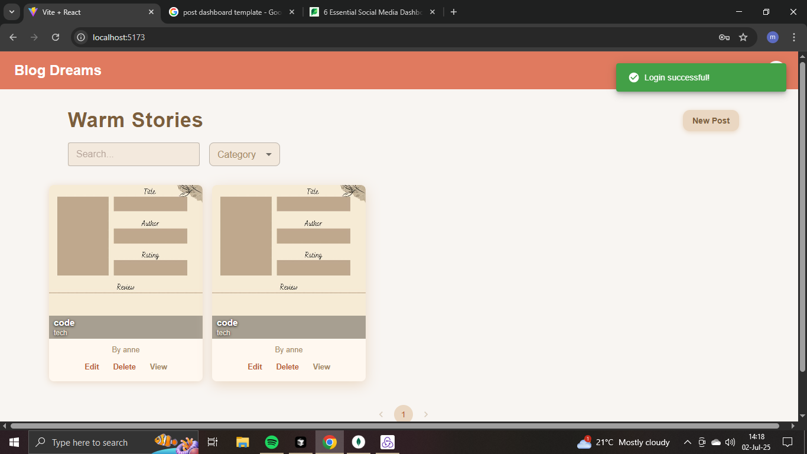

# MERN Blog App

A modern, full-stack blog application built with the MERN stack (MongoDB, Express.js, React.js, Node.js). The app features a sleek, responsive UI, user authentication, image uploads, comments, categories, and more.

---

## 🚀 Project Overview

This project is a feature-rich blogging platform where users can:
- Register, log in, and manage their profile
- Create, edit, and delete blog posts with images
- Categorize posts and filter/search by category
- Like/unlike posts
- Add and view comments
- Save posts as drafts or publish them
- Enjoy a modern, warm, and responsive design

---

## 🛠️ Setup Instructions

### **Prerequisites**
- Node.js (v18+ recommended)
- MongoDB (local or Atlas)

### **1. Clone the repository**
```sh
git clone <your-repo-url>
cd mern-blog-app
```

### **2. Setup the Server**
```sh
cd server
cp .env.example .env # Edit .env with your MongoDB URI and JWT secret
npm install
npm run dev
```

### **3. Setup the Client**
```sh
cd ../client
cp .env.example .env # Edit .env if needed (API URL)
npm install
npm run dev
```

- The backend runs on `http://localhost:5000`
- The frontend runs on `http://localhost:5173` (or as shown in your terminal)

---

## 📚 API Documentation

### **Authentication**
- `POST /api/auth/register` — Register a new user
- `POST /api/auth/login` — Login and receive JWT

### **Posts**
- `GET /api/posts` — Get all posts (supports pagination, search, filter)
- `GET /api/posts/:id` — Get a single post
- `POST /api/posts` — Create a post (auth required)
- `PUT /api/posts/:id` — Update a post (auth required)
- `DELETE /api/posts/:id` — Delete a post (auth required)

#### **Post Payload**
```json
{
  "title": "Post Title",
  "content": "Post content...",
  "category": "Tech",
  "author": "<userId>",
  "status": "Published", // or "Draft"
  "featuredImage": "/uploads/filename.jpg" // optional
}
```

### **Categories**
- `GET /api/categories` — Get all categories
- `POST /api/categories` — Create a category

### **Comments**
- `GET /api/comments/post/:postId` — Get comments for a post
- `POST /api/comments/post/:postId` — Add a comment to a post

### **Image Upload**
- `POST /api/upload` — Upload an image (form-data, field: `image`)

---

## ✨ Features Implemented
- User registration, login, and JWT authentication
- Create, read, update, delete (CRUD) for posts
- Image upload for post featured images
- Categories (type or pick when creating a post)
- Like/unlike posts
- Comments (add/view)
- Draft and published post status
- Pagination, search, and filtering
- Responsive, modern, and warm UI
- Protected routes for authenticated actions
- Accessibility and mobile-friendly design
- Presentable, gallery-style post grid: Posts are displayed in a centered, row-first, Instagram-inspired gallery with square images, overlays, and modern card styling. The grid is compact, visually balanced, and does not cover the whole page.
- Warm, modern UI/UX: The app features a cozy beige color palette, soft shadows, rounded corners, and a layout that is both inviting and professional.

---

## 📸 Screenshots

Screenshots of the app UI are stored in the `screenshots/` folder. To add your own, place image files in `screenshots/` and reference them here using markdown:

```markdown

```

Example:


---

## 📝 License
MIT 